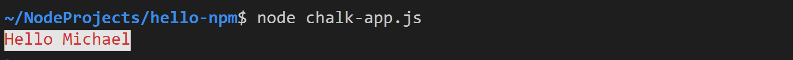
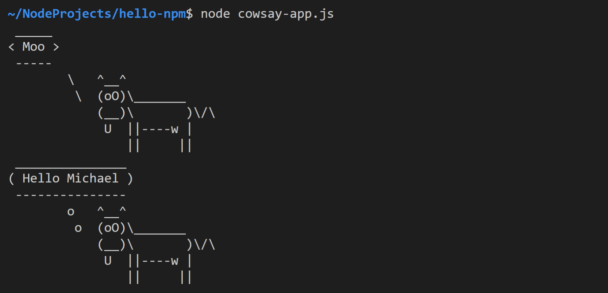

# Hello npm

## Task 1: Add package.json

Erstellen Sie mithilfe von `npm` ein `package.json`, das ihren GitHub-User als Autor enthält.

## Task 2: Add .gitignore

Erstellen Sie eine Gitignore-Datei hinzu, die sicherstellt, dass das (derzeit noch nicht vorhandene) Verzeichnis `node_modules` nicht Teil des Git-Repositorys sein wird.

## Task 3: Install chalk

Installieren Sie mithilfe von `npm` das package `chalk`. Legen Sie im `package.json` fest, das sich bei einer Neuinstallation oder einem Update nur die PATCH Version von `chalk` ändern darf.

## Task 4: Chalk app

Erstellen Sie die Datei `chalk-app.js`. Verwenden Sie darin `chalk` um den Text "Hello \<Ihr Name>" mit blauer Schrift auf weißem Hintergrund auszugeben.

## Task 5: Install cowsay

Installieren Sie mithilfe von `npm` das package `cowsay`. Legen Sie im `package.json` fest, das bei einer Neuinstallation oder einem Update genau die gleiche Version von `cowsay` installiert wird.

## Task 6: Execute cowsay

Führen Sie im Terminal `cowsay` mit dem Argument "Hello \<Ihr Name>" aus. Speichern Sie einen Screenshot der Konsolenausgabe in der Datei *cowsay-test.jpg*.

## Task 7: Cowsay app

Erstellen Sie die Datei `cowsay-app.js`. Verwenden Sie darin `cowsay` um jeweils eine Kuh auszugeben, die ...

- ... "Moo" *spricht*.
- ... sich "Hello \<Ihr Name>" *denkt*.

